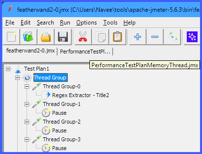

# Prism JMeter Plugin (OSS Edition)

Prism is a modern tab-style interface plugin for Apache JMeter. 

Historically, JMeter only allows you to view and interact with a single Test Plan at a time. Prism radically improves the JMeter user experience by injecting a multi-tabbed interface directly into the JMeter GUI, allowing you to load, view, and switch between completely isolated Test Plans simultaneously.

## Features (OSS Edition)
- **Multi-Tabbed Interface**: Opens JMeter Test Plans in separate tabs instead of overwriting the current workspace.
- **Lightning Fast Switching**: Swamp instantly between complex test plans without rebuilding the UI.
- **Safety First Data Isolation**: Each tab maintains its own underlying JMeter `GuiPackage` state to prevent cross-contamination and ensure your saved data is 100% isolated.
- **Dynamic Tab Names**: Tabs intelligently update themselves based on the loaded file name or the Root Test Plan node, with auto-truncation and tooltips so the UI always looks clean.
- **Maximum Tabs**: The Open-Source version of Prism allows up to **2 simultaneous active tabs** to be open.  




## 🚀 Installation & Requirements
**Prerequisites:**
- Java 11 or higher
- Apache JMeter 5.6.3+

**Installation Steps:**
1. Download the latest `prism-oss-x.x.x.jar` from the GitHub Releases page (or build it yourself).
2. Drop the `.jar` file directly into your JMeter `lib/ext` directory:
   - Example: `C:\path\to\apache-jmeter-5.6.3\lib\ext\`
3. Restart Apache JMeter.
4. You will see a new top level menu: `File -> New Prism Tab`.

## 🛠️ Building From Source
This project uses Maven for dependency management and builds.

1. Clone this repository:
```bash
git clone https://github.com/QAInsights/prism.git
cd prism
```
2. Build the project:
```bash
mvn clean package
```
3. The newly generated JAR will be located at `prism-oss/target/prism-oss-1.0.0-SNAPSHOT.jar`. Copy this file into your JMeter `lib/ext` folder.

## 🌟 Prism Pro Edition
Looking for more power? **Prism Pro** is available, dropping the 2-tab limit completely and offering:
- **Unlimited Test Plan Tabs**
- **Advanced Context Menus** (Browser-style tab closing: Close, Close Others, Close Right, Close All)
- **Custom UI Themes & Styles**

Visit [QAInsights](https://qainsights.com) for more information on upgrading to Prism Pro.

## License
This project is licensed under the Apache License 2.0. See the [LICENSE](LICENSE) file for more details.
